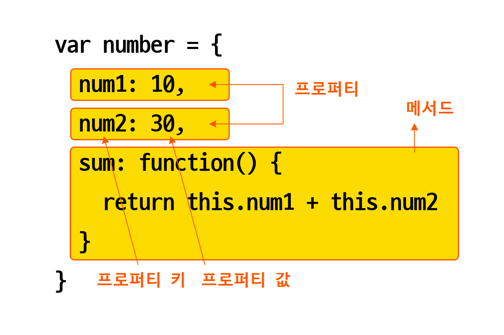

# 10장 객체 리터럴

## 객체
- **원시값을 제외한 나머지 값(함수, 배열, 정규 표현식)은 객체이다.**
- 원시값은 변경 불가능한 값이지만 객체는 **변경 가능한 값(mutable value)**이다.
- **함수는 일급 객체**이므로 값으로 취급할 수 있다.
- 객체는 **프로퍼티**와 **메서드**로 구성된다.


- 프로퍼티: **객체의 상태**를 나타내는 값
- 메서드:**프로퍼티를 참조하고 조작**할 수 있는 **동작**
- 객체는 상태와 독장을 하나의 단위로 구조화할 수 있어 유용하다.

## 객체 리터럴에 의한 생성
```javascript
var puppy = {
    name: 'mori',
    bark : function(){
        console.log('왈왈');
    }
}

var puppy = {} // 빈 객체
```

## 프로퍼티
- 객체는 프로퍼티의 집합이다.
- 프로퍼티는 **키**와 **값**으로 구성된다.
- 프로퍼티를 나열할 때는 `,`를 사용한다.
- 키: 빈 문자열을 포함하는 모든 문자열 또는 심벌 값
    - 프로퍼티 값에 접근할 수 있는 이름으로서 **식별자** 역할을 한다.
    - 심벌 값의 경우 키로 사용하려면 `'...'` 또는 `"..."`로 묶거나 식별자 네이밍 규칙을 따라야 한다.
- 밸류: 모든 값

### 프로퍼티의 네이밍 규칙
```javascript
var person = {
    firstName : 'Ha-Eun',
    'last-name' : 'Jo'
};
```
- 규칙을 지키지 않으면 `''`로 묶어줘야 한다!

### 프로퍼티 키 동적 생성
```javascript
var obj = {};
obj['hello'] = 'world';

console.log(obj); // {hello: world}
```

### 프로퍼티 키 - 암묵적 타입 변환
```javascript
var foo = {
    0 : 1,
    1 : 2,
    2 : 3
};
```
- 문자열/심벌 값이 아닌 값이 키로 들어오면 **암묵적 타입 변환**을 통해 `문자열`로 변환한다.

### 프로퍼티 키의 중복
```javascript
var foo = {
    name = 'ha eun',
    name = 'mori'
};

console.log(foo); // {name : 'mori'}
```
- 프로퍼티 키가 중복되면 나중에 선언한 프로퍼티가 먼저 선언한 프로퍼티를 **덮어쓴다**.

## 메서드
- 프로퍼티 값이 함수일 경우 일반 함수와 구분하기 위해 `메서드`라고 부른다.
- 즉, 메서드는 객체에 묶여 있는 함수를 의미한다.

```javascript
var circle = {
    radius : 5,
    getDiameter : function(){
        return this.radius * 2;
    }
}

console.log(circle.getDiameter());
```

## 프로퍼티 접근
- **마침표 표기법**: 마침표 프로퍼티 접근 연산자(`.`)룰 사용하는 방법이다.
- **대괄호 표기법**:대괄호 프러퍼티 접근 연산자(`[...]`)를 사용하는 방법이다.
    - 대괄호 프러퍼티 접근 연산자 내부에 지정하는 프러퍼티 키는 반드시 **따옴표로 감싼 문자열**이어야 한다.
- 식별자 네이밍 규칙을 준수하지 않는 프로퍼티 키의 경우 반드시 대괄호 표기법을 사용해야 한다. (단 숫자로 이루어진 문자열은 따옴표 생략이 가능함)

## 프로퍼티 동적 생성
- 존재하지 않는 프러퍼티에 값을 할당하면 프로퍼티가 동적으로 생성되어 추가되며 프로퍼티 갑이 할당된다.

```javascript
var person = {
    name : 'ha eun'
}

person.age = 24;

console.log(person); //{name : "ha eun", age : 24}
```

## 프로퍼티 삭제
- `delete`연산자는 객체의 프로퍼티를 삭제한다.
- 존재하지 않는 프로퍼티를 삭젷면 에러 없이 **무시**된다.
```javascript
delete person.age;
```

## 객체 리터럴의 확장 기능
- 프로퍼티 값은 변수에 할당된 값, 즉 식별자 표현식일 수도 있다.

```javascript
var x = 1, y = 2,

var obj = {
    x: x,
    y: y
};

console.log(obj); // {x: 1, y: 2};
```

### 프러퍼티 축약 표현
- `변수 이름 = 프로퍼티 키`인 경우 프로퍼티 키 생략 가능하다.
    - 이 경우, (키: 변수이름, 값: 변수 값)이 된다.
```javascript
var obj = {x, y};
```

### 프로퍼티 키 동적 생성
- 문자열 또는 문자열 타입으로 변환할 수 있는 값으로 평가되는 표현식을 사용하여 키를 동적 생성할 수 있다.
- 이 경우 객체 리터럴 외부에서 **대괄호 표기법**을 사용해야 한다.

```javascript
obj[prefix + ' ' + ++i] = i;
```

### 메서드 축약 버전
- ES6에서는 메서드를 정의할 때, function 키워드를 생략한 축약 표현을 사용할 수 있다.

``` javascript
const obj = {
    name: 'ha eun',
    sayHi(){
        console.log(`Hi ${this.name}!`);
    }
}
```


