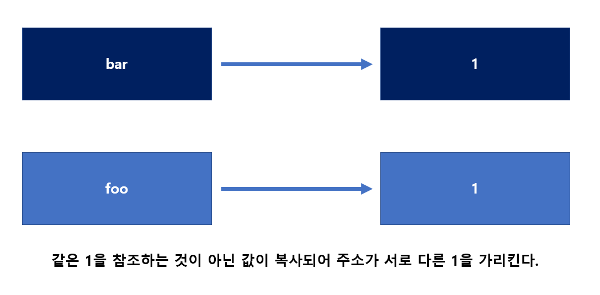

# 11장 원시 값과 객체의 비교

## 원시 타입
- 원시 타입의 값은 `변경 불가능한 값`이다.
    - 이 때 값은 변수가 아니라 `변수에 저장된 데이터`로서 표현식이 평가되어 생성된 결과를 말한다. 변경이 불가능하다는 것은 변수가 아니라 값이다.
        - 변수는 **재할당**을 통해 변수 값을 **교체**할 수 있다.
        - 상수의 경우 재할당이 금지되므로 변수 값을 변경할 수 없다.
        - 상수에 할당된 객체의 경우, 객체의 속성은 변경할 수 있다.
    
- 원시 값을 변수에 할당하면, 변수에는 **실제 값이 저장**된다.
- 원시 값을 갖는 변수를 다른 변수애 할당하면 **원시 값이 복사되어 전달**되며, <ins>값에 의한 전달이라고 한다.</ins>
- 원시값은 읽기 전용 값으로, **불변성**을 갖는다. 이러한 특성으로 인해 데이터의 신뢰성이 보장된다.
- 변수에 값을 재할당하면 원시값이 바뀌는 것이 아니고 메모리 공간의 주소가 바뀐다.

### 변수의 값을 변경하는 과정
1. 새로운 메모리공간 확보
2. 재할당할 값 저장
3. 변수가 참조하는 메모리 공간의 주소 변경

### 원시 타입인 문자열
- 자바스크립트에서 문자열은 원시 타입이다. 따라서 **불변성**을 갖는다.
- 문자열은 유사 배열 객체이면서 이터러블이다. 따라서 배열과 유사하게 접근이 가능하다.
    - 인덱스로 접근이 가능하며 length 프로퍼티를 갖는다. 또한 for문으로 순회도 가능하다.
    - **하지만 문자열은 원시값이므로 변경할 수 없다.** 

```javascript
var str = 'hello';
str[0] = 'H'
console.log(str); //hello
```

### 값에 의한 전달(Pass by Value)
- 원시 타입은 `값`으로 전달된다.
- 참조에 의해 전달되는 것과 달리 `값을 복사`하여 전달한다.
- a변수에 원시 값을 갖는 b변수를 할당하면 a변수에는 b변수의 **원시 값이 복사되어 전달된다**.
- 두 변수a, b의 값은 같지만 각각 **다른 메모리 공간에 저장된 별개의 값**이다.




## 객체 타입
- 객체는 `변경 가능한 값`이다.
- 프로퍼티의 개수가 정해져 있지 않으며 동적으로 추가되고 삭제할 수 있다. 또한 프로퍼티 값에도 제약이 없다.
- 확보해야 할 메모리 공간의 크기를 사전에 정해둘 수 없다.
- 객체를 변수에 할당하면, 변수에는 **참조 값이 저장**된다.
- 객체를 가리키는 변수를 다른 변수에 할당하면 원본의 **참조 값이 복사되어 전달**된다. 이를 <ins>참조에 의한 전달이라고 한다.</ins>
- 재할당 없이 프로퍼티를 동적으로 추가하거나, 갱신, 삭제할 수 있다.
- 여러 개의 식별자가 하나의 객체를 공유할 수 있다.

### 얕은 복사
얕은 복사는 중첩되어 있는 객체들은 복사하지 않고 가장 상위 수준의 값들만 복사한다. 따라서 중첩된 객체들은 기존 객체와 동일한 참조를 공유하게 된다. 즉, 복사본과 원본이 중첩된 객체를 공유하게 되어, 복사된 객체를 수정할 경우 원본에도 영향을 줄 수 있다.


### 깊은 복사
객체를 복사할 떄, 상위 객체뿐만 아니라 모든 중첩된 객체들까지 재귀적으로 복사하여 완전히 독립적인 새 객체를 만드는 방법이다. 깊은 복사가 된 객체는 원본 객체와 전혀 다른 메모리 주소를 갖게 된다. 따라서 수정해도 원본 객체에 전혀 영향을 미치지 않는다.


### 참조에 의한 전달
- 객체를 가리키는 변수를 다른 변수에 할당하면, 원본의 **참조 값이 복사되어 전달**되는 것을 참조에 의한 전달이라고 한다.
- 이 경우 **두 개의 식별자가 하나의 객체를 공유**하게 된다.

